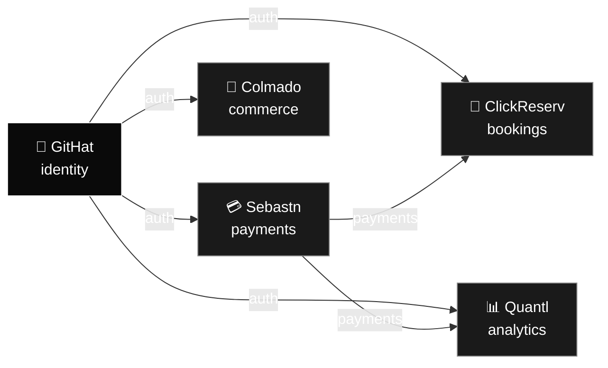

# Rensley R.

**Founder, builder, platform engineer — New York, NY**

Building [GitHat](https://www.githat.io): a fleet of apps sharing one identity layer, one payments rail, one deploy story.

---

## The fleet

Single edge pattern across every app. Certs auto-rotate. No third-party CAs.

## What I'm building

| App | Domain | What it does |
|---|---|---|
| **GitHat** | [githat.io](https://githat.io) | Identity layer for the fleet |
| **Sebastn** | [sebastn.com](https://sebastn.com) | Payments rail |
| **ClickReserv** | [reserv.click](https://reserv.click) | Multi-tenant booking SaaS |
| **Quantl** | [quantl.click](https://quantl.click) | Quant signals + forecasting |
| **Colmado** | [colmado.click](https://colmado.click) | Commerce |

## How I ship

- **Cloud-native edge** — one pattern, every app, certs auto-rotate
- **One identity provider** — verified locally, no shared secrets between apps
- **One payments rail** — businesses onboard as connected accounts
- **AI-native dev loop** — every repo ships with agent metadata
- **Sized for unit economics** — not vanity

## Stats

---

Currently shipping <a href="https://reserv.click">ClickReserv</a> · <a href="https://www.githat.io">githat.io</a>

