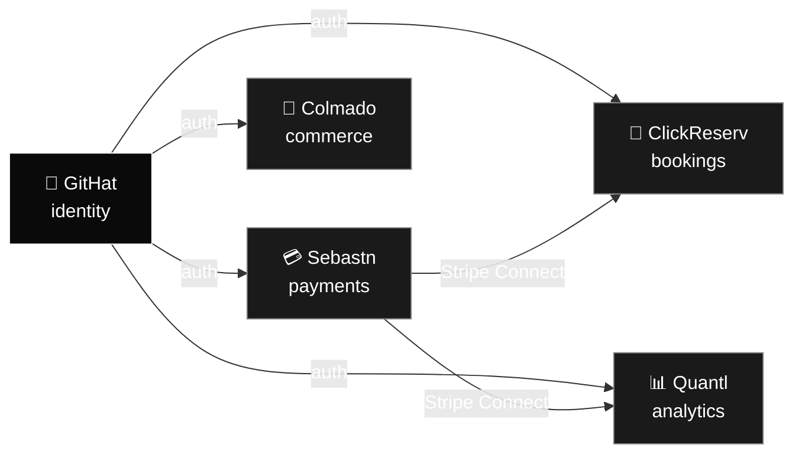

# Rensley R.

**Founder, builder, and platform engineer — New York, NY**

Building the [GitHat](https://www.githat.io) platform: a fleet of AWS-native apps sharing one identity provider, one payments rail, and one deploy pattern.

---

## The fleet

Every app: **Route 53 → CloudFront → EC2 (Caddy → Node)** with auto-rotating ACM certs and CAA lockdown. No third-party CAs, no third-party CDNs.

## What I'm building

| App | Domain | What it does |
|---|---|---|
| **GitHat** | [githat.io](https://githat.io) | RS256/KMS identity provider for the fleet |
| **Sebastn** | [sebastn.com](https://sebastn.com) | Stripe Connect payments-as-a-service |
| **ClickReserv** | [reserv.click](https://reserv.click) | Multi-tenant booking SaaS (26 templates) |
| **Quantl** | [quantl.click](https://quantl.click) | Quant signals + forecasting |
| **Colmado** | [colmado.click](https://colmado.click) | Commerce |

## Stack I ship with

## Approach

- **AWS-native edge** — Route 53 + CloudFront + ACM, no Cloudflare, no Let's Encrypt
- **One identity provider** — RS256/JWKS, KMS-backed, no shared secrets between apps
- **Stripe Connect** — businesses onboard as connected accounts under Sebastn's platform
- **AI-native developer experience** — every repo ships with `CLAUDE.md` and MCP server hooks where it matters
- **Standalone Next.js on t2.micro** — sized for unit economics, not vanity

## Stats

---

Currently shipping <a href="https://reserv.click">ClickReserv</a> · find me at <a href="https://www.githat.io">githat.io</a>

