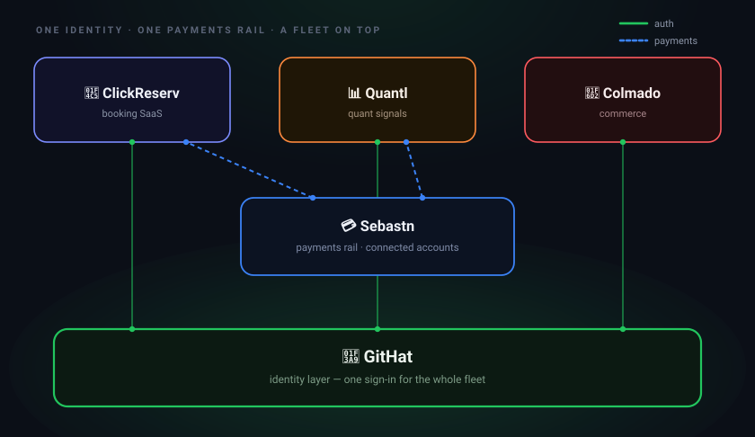

# <!-- IDENTITY:name -->
Rensley R.
<!-- /IDENTITY:name -->

**Founder, builder, platform engineer — <!-- IDENTITY:location -->
New York, NY
<!-- /IDENTITY:location -->**

🛠️ <!-- IDENTITY:status -->shipping the GitHat fleet<!-- /IDENTITY:status -->

Building [GitHat](https://www.githat.io): a fleet of apps sharing one identity layer, one payments rail, one deploy story.

[
<!-- /IDENTITY:x -->-000?style=for-the-badge&logo=x&logoColor=white)](https://x.com/VyperPilledDev)

---

## The fleet

  

**GitHat** is the identity layer — every app signs in through it, so there's no per-app auth to build. **Sebastn** is the payments rail; ClickReserv and Quantl run charges through it, and businesses onboard once as connected accounts. Add a new app to the fleet and auth + payments are already solved.

## What I'm building

<!-- IDENTITY:fleet_table -->
| App | Domain | Role |
|---|---|---|
| **GitHat** | [githat.io](https://githat.io) | Identity layer for the fleet |
| **Sebastn** | [sebastn.com](https://sebastn.com) | Payments rail |
| **ClickReserv** | [reserv.click](https://reserv.click) | Multi-tenant booking SaaS |
| **Quantl** | [quantl.click](https://quantl.click) | Quant signals + forecasting |
| **Colmado** | [colmado.click](https://colmado.click) | Neighborhood commerce |
<!-- /IDENTITY:fleet_table -->

## How I ship

- **Cloud-native edge** — one pattern, every app, certs auto-rotate
- **One identity provider** — verified locally, no shared secrets between apps
- **One payments rail** — businesses onboard as connected accounts
- **AI-native dev loop** — every repo ships with agent metadata
- **Sized for unit economics** — not vanity

## Stats

<!-- DYNAMIC:START -->
> 🌱 Spring sprint — building in bloom.
>
> 📅 **1,774 days on GitHub** · 4 years, 314 days · 253 weeks
> _Last updated: 2026-05-17 (America/New_York)_
<!-- DYNAMIC:END -->

---

Currently shipping <a href="https://reserv.click">ClickReserv</a> · <a href="https://www.githat.io">githat.io</a>

